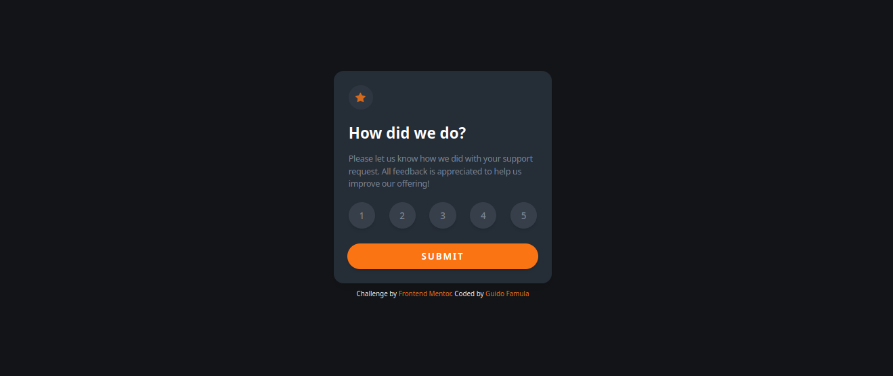
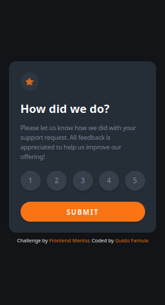

# Frontend Mentor - Interactive rating component solution

This is a solution to the [Interactive rating component challenge on Frontend Mentor](https://www.frontendmentor.io/challenges/interactive-rating-component-koxpeBUmI). Frontend Mentor challenges help you improve your coding skills by building realistic projects.

## Table of contents

- [Overview](#overview)
  - [The challenge](#the-challenge)
  - [Screenshot](#screenshot)
  - [Links](#links)
- [My process](#my-process)
  - [Built with](#built-with)
- [Author](#author)

## Overview

### The challenge

Users should be able to:

- View the optimal layout for the app depending on their device's screen size
- See hover states for all interactive elements on the page
- Select and submit a number rating
- See the "Thank you" card state after submitting a rating

### Screenshot

Desktop Version

Mobile Version

### Links

- Solution URL: [frontmentor.io/solutions](https://www.frontendmentor.io/solutions/interactive-rating-component-ezPE3EAh2F)
- Live Site URL: [interactive-rating-gh-pages](https://guidofamula.github.io/interactive-rating-statis/)

### Built with

- Flexbox
- CSS Grid
- HTML & Javascript
- Mobile-first workflow
- [Tailwind CSS](https://tailwindcss.com/) - For styles
- [GH Pages](https://github.com) - Deployment

## Author

- My Website - [GUIDOFAMULA.COM](https://guidofamula.com)
- Frontend Mentor - [@guidofamula](https://www.frontendmentor.io/profile/guidofamula)
- Linkedin - [Guido Famula](https://www.linkedin.com/in/guido-famula/)
